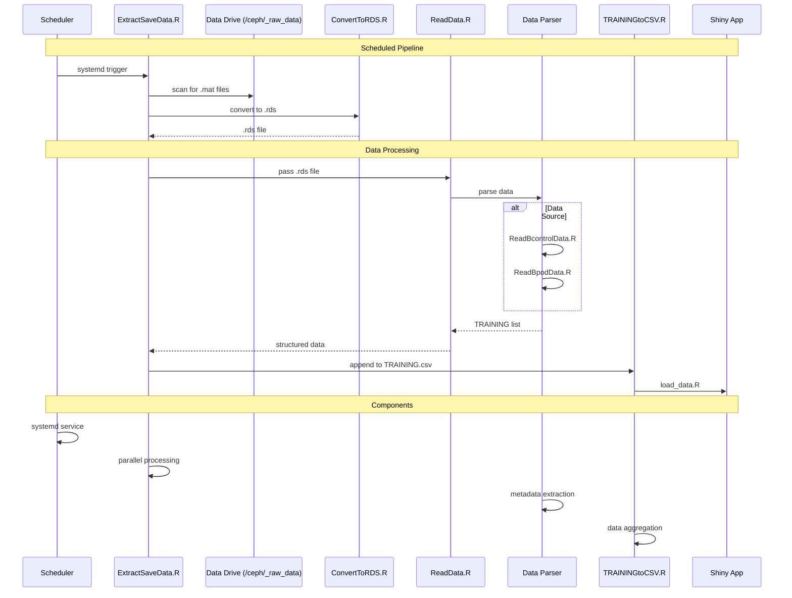
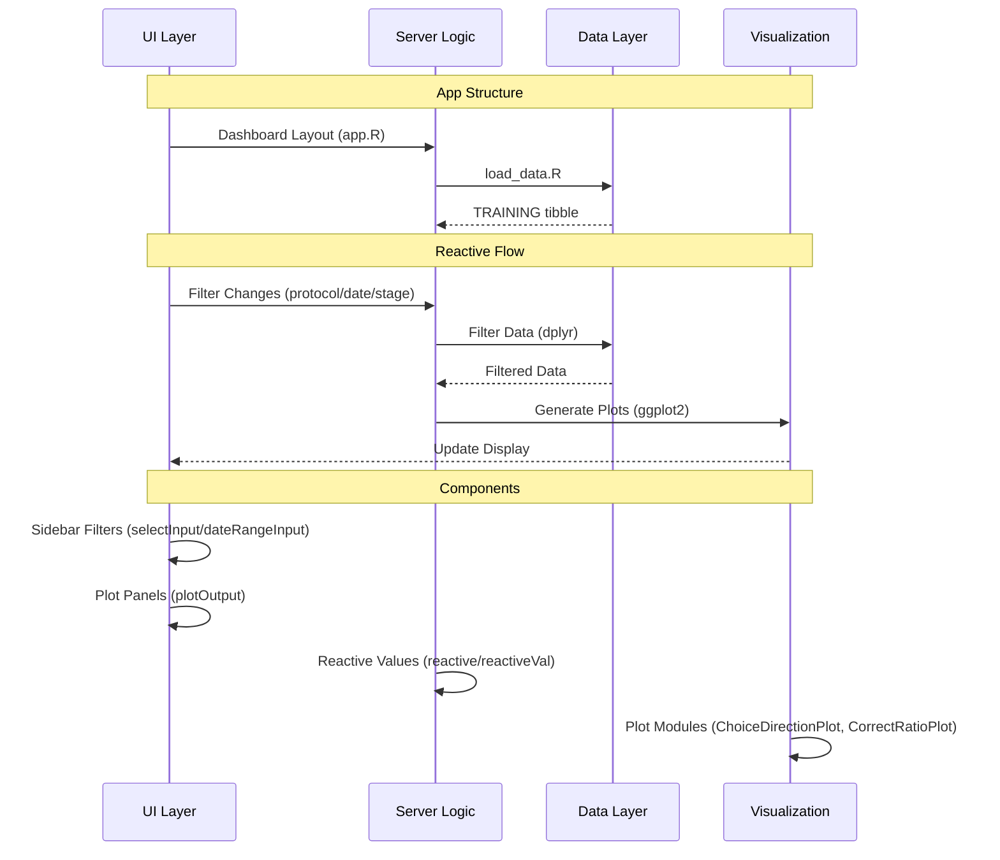

# Project Architecture

This document outlines the architecture and data flow of the **Shiny Performance Tracking** system. The project processes and visualizes rodent training data collected via **BControl** or **Bpod** experimental setups.


## High-Level Components

- **Raw Input**: `.mat` files from behavioral rigs.
- **Conversion**: Transformed to `.rds` files using `R.matlab`.
- **Parsing**: Extracted into structured R lists representing metadata and trial data.
- **Aggregation**: Session-level summaries are appended into `TRAINING.csv`.
- **Visualization**: Interactive Shiny app for viewing trends across animals, stages, and protocols.

## Data Flow

1. `.mat` files are collected in `/ceph/_raw_data/_rat_training_172/SoloData/Data`
2. A scheduled job (via `systemd` on our VM) triggers `ExtractSaveData.R`, which orchestrates the entire pipeline:
   - Scans the drive for new `.mat` files
   - Converts them to `.rds` files using `ConvertToRDS.R`
   - Passes the `.rds` to `ReadData.R`, which wraps:
     - `ReadBcontrolData.R` (for BControl files), or
     - `ReadBpodData.R` (for Bpod files)
   - Receives a structured `TRAINING` list and appends it to `TRAINING.csv` using `TRAININGtoCSV.R`
3. The Shiny app (`shiny_app/app.R`) loads `TRAINING.csv` using `load_data.R`
4. Interactive plots are generated using modules in `shiny_app/functions/`



## Shiny App Architecture



##  Folder Structure Summary

```
shiny-performance-tracking/
├── shiny_app/
│   ├── app.R                   # Main Shiny app
│   ├── functions/              # Plot modules
│   └── TRAINING.csv            # Aggregated session-level data
├── utility_functions/
│   ├── ConvertToRDS.R
│   ├── ReadBcontrolData.R
│   ├── ReadBpodData.R
│   ├── ReadData.R
│   └── TRAININGtoCSV.R
├── ExtractSaveData.R          # Main batch processor

```


## Plot Functions

These are modular ggplot-based scripts that power the Shiny dashboard:

- `ChoiceDirectionPlot.R`: Boxplot of pokes per direction
- `CorrectRatioPlot.R`: Line plot of correct/total trials
- `CompletedTrialsPlot.R`: Daily trial counts
- `StageTrackingPlot.R`: Tracks stage progression per animal

Each one uses a consistent API: filters by protocol, date, stage, experimenter, and animal.


## Design Notes

- The pipeline is **idempotent**: new files are processed only once.
- `ExtractSaveData.R` uses parallel processing for speed.
- Trial-level data extraction is supported but optional (commented).
- Shiny app uses preprocessed `.csv` rather than raw `.rds` for performance.
